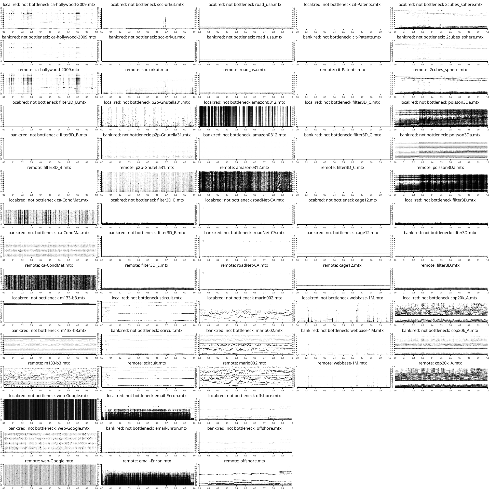

# the splited trace file
- each 3 graphs in a col represent the same graph(show in the title)
- the red point means it's ***not*** the bottlenet, the black point means it ***is*** the bottleneck
- 
# the new point trace(merged)
- the local:RED
- the bank dispatcher: BLACK
- the remote: BLUE
- 

# the all trace
- the x axis is the time, the y axis is the bank id,
- the blacker point means the cycle is large
- the lighter point means the cycle is small
- if it's full black, it means the cycle is cycle-max
- if it's full white, it means the cycle is 0
- 